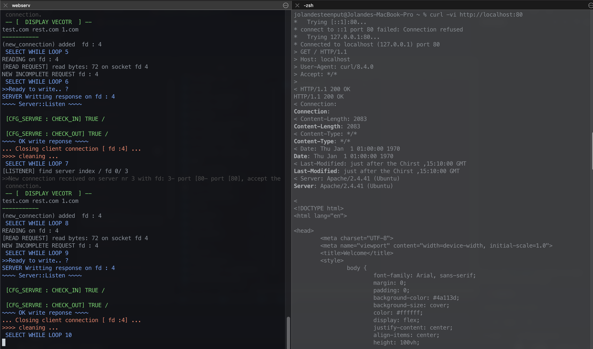

# webserv

A lightweight HTTP/1.1 server in C++98, built for the 42 Webserv project.

This project implements a custom web server with non-blocking sockets, multiplexed I/O, request parsing/validation, configurable virtual servers and routes, static file serving, CGI execution, file upload handling, and custom error pages.

## Project Context

- School project: 42 Webserv
- Language standard: C++98
- Build system: Makefile
- Executable: webserv
- Default config: configFiles/defaultConfig.conf

## Subject Scope (42 Webserv)

The implementation is aligned with the expected Webserv goals:

- Single-process event loop with non-blocking sockets
- Multiplexed client handling (select in this implementation)
- HTTP request parsing and response generation
- Route-level behavior (methods, index/default file, upload path, CGI toggle)
- Support for GET, POST, and DELETE
- File upload flow and body-size protection
- CGI execution by extension mapping
- Custom error pages
- Multiple server blocks/listeners via configuration

## Features Implemented

- Event-driven server loop using select
- Multiple server instances loaded from one config file
- Host-based server selection using the Host header
- Request line and header validation
- Supported methods: GET, POST, DELETE
- Static file and HTML page serving
- Directory listing mode (tree view)
- Route-based redirection support
- Route-level allowed methods
- Custom error file mapping by status code
- Multipart/form-data parsing for uploads
- Payload-size checks (413 handling)
- CGI support for Python (.py) and Perl (.pl) routes
- Built-in demo pages for GET/POST/DELETE and CGI tests

## Repository Layout

- includes: headers organized by module
- sources: C++ implementation files
- configFiles: sample server configurations
- basicweb: demo website and static assets
- cgi-bin: CGI scripts used by configured routes
- uploads: upload target directory
- Makefile: build rules

## Build

```bash
make
```

Useful targets:

```bash
make clean
make fclean
make re
```

## Run

Default config:

```bash
./webserv
```

Custom config:

```bash
./webserv configFiles/singleServeConfig.conf
./webserv configFiles/multiServerConfig.conf
```

## Configuration

This project uses a custom config grammar (not nginx syntax). Example:

```conf
Config ;
% 1 ;
Server ;
listen 127.000.000.001 04443 ;
domains test.com rest.com 1.com ;
entry ./basicweb ;
% 2 ;
errors /site/errors/error400.html [400,407,408] ;
errors /site/errors/error405.html [406,403,405] ;
bodySize -1 ;

Route / ;
method [GET] ;
redirect false ;
entry ./basicweb ;
treeVieuw off ;
defPage /site/index.html ;
uploadPath /uploads ;
cgi-bin disabled none ;
ENDRoute ;
ENDServer ;
ENDConfig ;
```

### Main Directives

- listen: host and port for a server block
- domains: accepted hostnames for virtual host matching
- entry: server root path
- errors: custom error file mapped to status codes
- bodySize: max accepted body size
- Route: URI location block
- method: allowed methods per route
- redirect: redirect target or false
- treeVieuw: directory listing toggle
- defPage: default file for the route
- uploadPath: target path for uploaded files
- cgi-bin: CGI permission and extension for the route

## Default Demo Routes

From configFiles/defaultConfig.conf and configFiles/singleServeConfig.conf:

- /: main page
- /get: GET page and listing mode
- /post: POST upload form
- /delete and /delete-file: delete workflow
- /cgi: CGI landing page
- /cgiPython: Python CGI route
- /cgiPerl: Perl CGI route
- /cgi-bin/generic_image: uploaded image display helper

From configFiles/multiServerConfig.conf:

- Server on port 4444
- Server on port 4445

## CGI

The project includes sample CGI scripts in cgi-bin:

- query.py: simple Python CGI greeting output
- upload_image.py: CGI output for uploaded image preview
- query.pl: Perl CGI greeting output

Routes can enable/disable CGI and specify extension handling in config.

## Validation and Error Handling

- Validates request line format and method support
- Validates header keys/values and duplicate headers
- Enforces mandatory headers for method-specific flows
- Verifies route/method compatibility
- Applies custom or fallback error pages
- Handles payload-too-large with HTTP 413

## Screenshots

Main page:


Terminal/runtime:



## Notes

- This is an educational HTTP server project and not production software.
- The codebase is intentionally modular to separate parsing, validation, handling, and response building.
